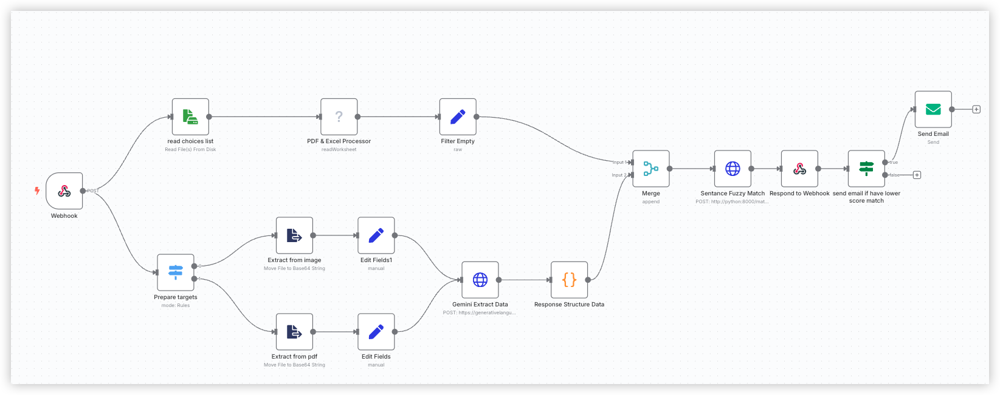

## 快速开始

### 1. 克隆仓库

```bash
git clone git@github.com:akulubala/n8n-data_extraction.git
cd n8n-data_extraction

2. 配置环境变量
编辑 .env 文件，设置所需的环境变量（GEMINI_KEY）。

3. 启动服务
docker compose up -d

4. 文件上传与访问

上传的產品清單存放在 uploads/ 目录
可通过 http://localhost/uploads/<filename> 访问上传的文件

5. webhooks 通过post 触发，

curl --request POST \
  --url http://0.0.0.0:5678/webhook-test/89f67403-3d86-46b3-8056-463454cb7663 \
  --header 'Content-Type: multipart/form-data' \
  --form docx=undefined \ ## docx 作为文件上传名称
  --form 'customer_name=Raymond Cheng' ## 客户名称

6. Fuzzy Match 使用docker service ”python“， 可参考python/srv/fuzzy_match 包。 借助sentence-transformers 实现

7. 流程
 

8. 可直接导入根目录下LLM_____.json 测试
