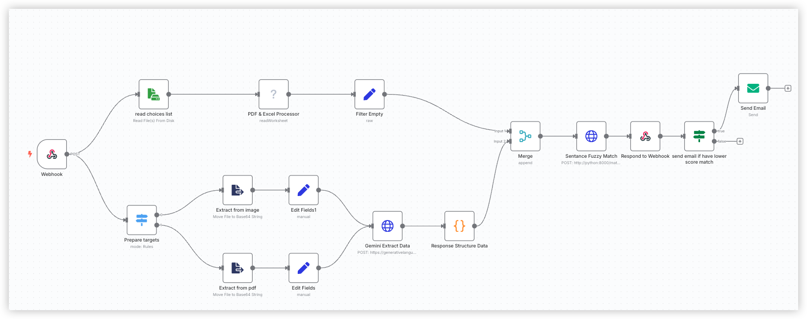

## Quick Start

### 1. Clone the Repository

```bash
git clone git@github.com:akulubala/n8n-data_extraction.git
cd n8n-data_extraction
```

### 2. Configure Environment Variables

Edit the `.env` file and set the required environment variables (e.g., `GEMINI_KEY`).

### 3. Start the Service

```bash
docker compose up -d
```

### 4. File Upload and Access

- Uploaded product lists are stored in the `uploads/` directory.
- You can access uploaded files via `http://localhost/uploads/<filename>`.

### 5. Trigger Webhooks via POST

```bash
curl --request POST \
  --url http://0.0.0.0:5678/webhook-test/89f67403-3d86-46b3-8056-463454cb7663 \
  --header 'Content-Type: multipart/form-data' \
  --form 'docx=@yourfile.docx' \ # 'docx' is the file upload field name
  --form 'customer_name=Raymond Cheng' # Customer name
```

### 6. Fuzzy Match

- Use the "python" docker service, refer to the `python/srv/fuzzy_match` package.
- Implemented with sentence-transformers.

### 7. Workflow



### 8. You can directly import `LLM_____.json` in the root directory for testing.
